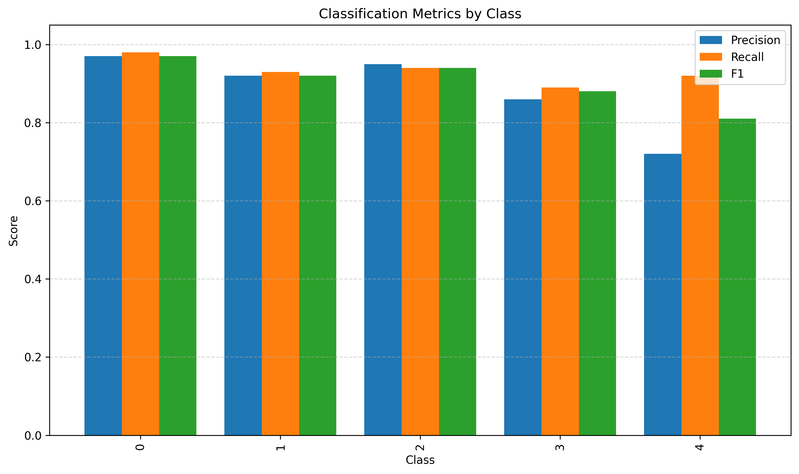
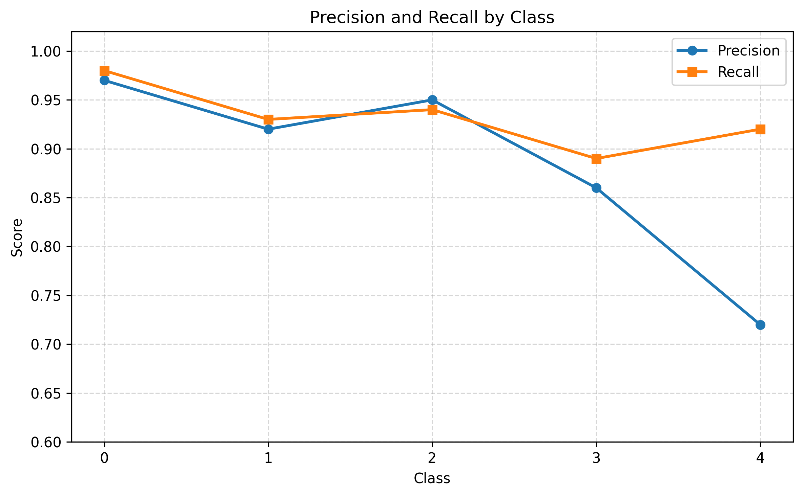
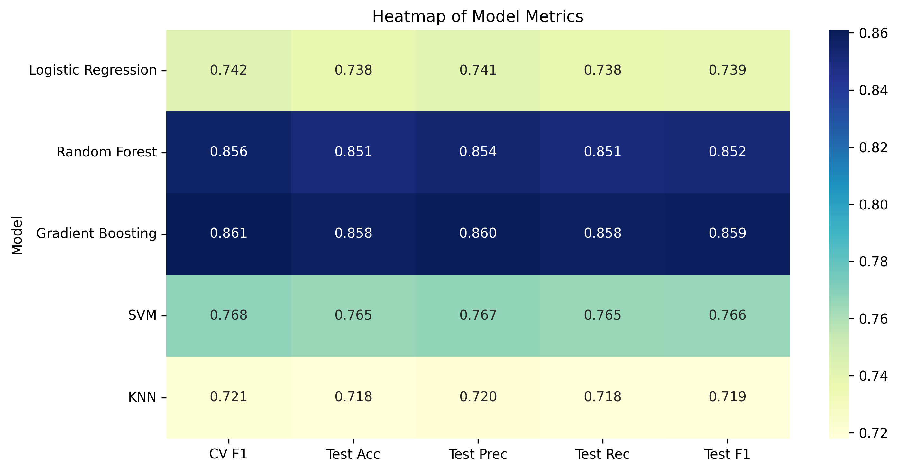
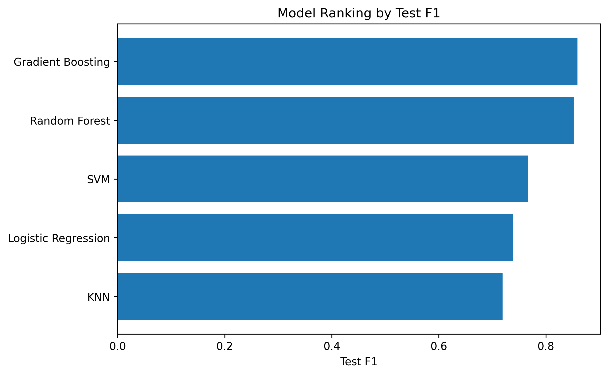

## MLAIRQuality – интеллектуальная система контроля качества воздуха в системах вентиляции больших зданий. #

Авторы:

Неустроев Илья

Харлов Максим

Лещишин Роман

Савельев Денис

___

## Описание бизнес-задачи ##

Коротко о том, в чем состоит проблема и почему эту задачу можно решить с помощью ML-модели.

Традиционные системы не адаптивны, они работают по заданному алгоритму, пусть даже и с привязкой к показаниям датчиков, они не хранят историю, не используют эту информацию для прогнозирования и управления системой.

В итоге имеем:

- перерасход энергии, когда вентиляция работает там, где не нужно (в отдельных помещениях);
- неравномерное качество воздуха. Такая ситуация возникает, когда факторы загрязнения распределяются по зданию неравномерно, а система вентиляции работает равномерно централизованно;
- износ оборудования. Это следствие пустопорожней работы; 
- ручная регулировка – зависимость от человеческого фактора. Часто вентиляция запитана от света в помещениях, который используется как признак присутствия человека. Однако фактором загрязнения может быть не только человек (скоропортящейся продукты, химические вещества);
- Потери тепла через рекуператор. Довольно часто в приточно-вытяжных системах вентиляции используют рекуператоры для того, чтобы в теплообменнике нагреть приточный воздух вытяжным. Раз мы все равно нагретый вытяжной воздух выбрасываем в атмосферу, то рационально будет нагреть им напоследок приточный воздух. Однако, в классических системах, нагретый воздух может попусту уходить в вытяжку из помещения, ведь система работает централизованно и там, где не требуется;

Имеются магистральные воздуховоды приточной и вытяжной вентиляции, от которых выполнены ответвления в отдельные помещения:


В каждом помещении имеется Arduino с датчиками с wi-fi модулем и клапаном на сервоприводе. С настраиваемой частотой Arduino передает данные с датчиков на web-сервер, на котором запущено наше приложение с ML-моделью. Эти приложение накапливает статистику, периодически переобучает модель и выполняет предикт индекса качества воздуха в отдельном помещении. Если он понизился, мы знаем где, посылаем json Arduino с командой открыть клапан и json контроллеру вентилятора, это тоже Arduino с wi-fi модулем и мощными твердотельными реле (мощная нагрузка до 10-100 КВт).

---

## Описание схемы пайплайна ##


**1. Полный цикл данных:**

1.  Сбор данных
    - ESP32 отправляет JSON‑пакеты с показаниями датчиков на Flask‑сервер (эндпоинт /data).
    - В пакете: room_id, дата/время, показания датчиков (temp, hum, mq7 и т. д.).
2.  Предварительная обработка
    - Сервер извлекает дату из поля date, вычисляет season (по месяцу) и weekday (день недели).
    - Обновляет глобальное хранилище last_data последними значениями.
3.  Прогноз ML‑модели
    - Модель (AirQualityPredictor) получает данные из last_data.
    - Заменяет значения -1 на средние (метод preprocess_features).
    - Масштабирует признаки через StandardScaler.
    - Классифицирует качество воздуха (iaq_class от 0 до 5) и возвращает вероятности классов.
    - Добавляет рекомендацию (recommendation) на основе класса.
4.  Сохранение в БД
    - Функция save_to_database преобразует и валидирует все поля.
    - Сохраняет запись в таблицу sensor.data PostgreSQL:
       - сырые данные датчиков;
       - вычисленные season, weekday;
       - предсказанный iaq_class;
       - iaq_proba (JSON с вероятностями классов).
5.  Обратная связь
    - Клиент (ESP32 или веб‑интерфейс) получает ответ:

json

{

"status": "success",

"packet_number": 123,

"iaq_class": 2,

"recommendation": "Удовл."

}

6.  Переобучение (опционально)
    - По запросу /retrain модель переобучается на последних N записях из БД.
    - Сохраняет обновлённую модель и скалер

**2. Подробная логика работы пайплайна:**

1\. Обучение модели

После запуска python air_quality_ml.py, класс:

- читает CSV
- делает AutoML-подбор через RandomizedSearchCV
- сохраняет модель в artifacts/
- пишет отчёт в reports/
- пишет метаданные и эксперименты в monitoring/

2\. Работа Flask-сервера

Когда Flask получает запрос на /predict, модель:

- делает предсказание
- пишет строку в monitoring/predictions.jsonl
- возвращает JSON с iaq_class, вероятностями и рекомендацией

3\. Мониторинг дрейфа

Когда вызываем /monitoring/drift, сервер:

- сравнивает два CSV
- строит список признаков с PSI-подобной оценкой
- сохраняет отчёт в monitoring/drift_YYYYMMDD_HHMMSS.csv

4\. Результаты обучения

- Отчёты обучения: в папке reports/: train_report_\*.txt — человекочитаемый отчёт, train_report_\*.json — машинно-читаемая сводка с метриками и classification_report.
- Логи экспериментов: файл monitoring/experiments.jsonl — это построчный JSON - каждая строка — один запуск обучения; Удобно смотреть через jq, Python, VS Code или лог-вьювер.

**3. ETL‑процесс (Extract‑Transform‑Load)**

1\. Extract (извлечение)

- Источник: JSON‑запросы от ESP32 (HTTP POST /data).
- Метаданные: room_id, date, time.
- Сырые данные: 15+ полей датчиков (temp, hum, mq7, ens_co2 и др.).

2\. Transform (преобразование)

- Вычисление признаков:
   - season — по месяцу из date (get_season_by_month).
   - weekday — день недели (isoweekday()).
- Очистка данных:
   - замена -1 → среднее значение по столбцу (в preprocess_features);
   - приведение типов (int, float) и подстановка дефолтов (safe_convert).
- Масштабирование: StandardScaler (обучается при первом обучении модели).
- Прогноз: классификация iaq_class (0–5) + вероятности.
- Пост‑обработка: генерация текстовой рекомендации (get_recommendation).

3\. Load (загрузка)

- Приёмник: таблица sensor.data в PostgreSQL.
- Поля: все сырые и вычисленные признаки + iaq_class, iaq_proba, packet_count.
- Формат: структурированная запись с временными метками и метаданными комнаты.

---

## Архитектура ML‑модели ##

Модель: RandomForestClassifier (sklearn)

Гиперпараметры:  
· n_estimators=200 — 200 деревьев;  
· max_depth=15 — ограничение глубины;  
· random_state=42 — воспроизводимость;  
· class_weight='balanced' — учёт дисбаланса классов.

Вход: 16 признаков (см. feature_columns).

Выход: класс iaq_class (0–5):  
· 0: «Отлично»;  
· 1: «Хорошо»;  
· 2: «Удовлетворительно»;  
· 3: «Плохо»;  
· 4: «Очень плохо»;  
· 5: «АВАРИЯ!».

Оценка: classification_report (точность, полнота, F1).

Сохранение: joblib (модель + скалер).

Особенности:  
· обработка пропусков (-1 → среднее);  
· инкрементальное обучение (/retrain из БД);  
· вероятностный вывод (predict_proba) для интерпретации;  
· быстрый режим подбора: RandomizedSearchCV с n_iter=3–5, cv=2, ограниченное пространство гиперпараметров (n_estimators , max_depth , min_samples_split , min_samples_leaf ), n_jobs=1;  
· режим продакшн: online — только predict() в Flask; offline — полное AutoML по расписанию;

**Отчет по метрикам с применением AutoML:**


Визуализация




В ходе решения задачи, был рассмотрен также вариант применения чистой модели RandomForestClassifier (в виду требования по производительности системы). При этом были получены такие метрики:


Визуализация




Модель RandomForest показала устойчиво хорошие показатели по всем метрикам. Преимущества такого подхода:

1. отличные показатели
2. не нужно масштабировать, значит проще внедрить
3. не чувствительна к мультиколлинеарности
4. быстро обучается
5. дает интерпретацию результата, на последней картинке коэффициенты, которые дала модель. Видно, какой параметр сильнее будет влиять
6. Устойчив к выбросам в отличии от градиентного бустинга : выбросы, шум и нелинейности, которые «ломают» градиентный бустинг, но Random Forest переносит спокойно.

<br/>При выборе модели смотрим на F1 метрику, т.к.:

- устойчивее к дисбалансу классов чем accuracy. Ситуация с классом 5 (когда все оч плохо) может встречаться редко, но ее очень важно предсказывать. Если использовать accuracy, то можно получить высокие значения на большинстве классов, но не предсказать самые опасные.
- интегральная оценка дает равный вклад каждого класса в метрику (пропорционально частоте)

Важно не просто иметь высокий процент угадывания класса, но еще и точно угадывать редкие классы (например класс авария встретится редко но очень важно его отловить)

Лог эксперимента:

{"timestamp": "2026-05-29T23:09:42.854997", "rows": 1053970, "best_params": {"clf_\_n_estimators": 120, "clf_\_min_samples_split": 2, "clf_\_min_samples_leaf": 2, "clf_\_max_features": "sqrt", "clf_\_max_depth": 10, "clf_\_bootstrap": true}, "train_accuracy": 0.9323308538193686, "test_accuracy": 0.9303538051367686, "train_f1_macro": 0.9076681161451852, "test_f1_macro": 0.9056605302755936}

---

## Тестирование ML-модели ##

1. Модель

Проверяется сам класс AirQualityPredictor:

- модель загружается;
- preprocess_features() корректно заменяет -1 и заполняет пропуски;
- predict() возвращает iaq_class, probabilities, recommendation;
- fit() реально обучает модель и сохраняет артефакты.

2. API Flask

Проверяются HTTP-эндпоинты:

- GET /status;
- POST /predict;
- POST /retrain;

3. Мониторинг

Проверяется, что система пишет артефакты:

- reports/train*report*\*.txt и .json;
- monitoring/experiments.jsonl;
- monitoring/predictions.jsonl;
- monitoring/drift\_\*.csv.

### Инструкции ###
Тестирование реализовано с помощью pytest. Тесты находятся в папке tests/:
``` 
test_air_quality_predictor.py - загрузка модели, preprocess_features(), predict(), fit()
test_api.py                   - тесты Flask-эндпоинтов
test_monitoring.py            - проверка записи артефактов

Запуск тестов: pytest tests/ -v
```
---

## Docker-контейнеризация ##

Структура проекта:

```text
MLOps_AirQuality/
├── docker-compose.yml
├── .github/
│   └── workflows/
│       └── ci-cd.yml
├── TESTS/
│   ├── requirements.txt
│   ├── test_air_quality_ml.py
│   └── test_flask_api.py
├── FRONTEND/
│   └── web-server/
│       └── server.py          # основной Flask-сервер (порт 5000)
├── ML/
│   ├── Dockerfile
│   ├── requirements.txt
│   ├── air_quality_ml.py      # AirQualityPredictor + Flask (порт 5001)
│   ├── artifacts/
│   ├── monitoring/
│   ├── reports/
│   └── testdata/
└── sql/
    └── init.sql
```
#### ML-сервис Dockerfile (ML/Dockerfile)
```text
FROM python:3.10-slim

WORKDIR /app

RUN apt-get update && apt-get install -y --no-install-recommends \
    curl \
    postgresql-client \
    gcc \
    && rm -rf /var/lib/apt/lists/*

COPY requirements.txt .
RUN pip install --no-cache-dir -r requirements.txt

COPY . .

RUN mkdir -p artifacts monitoring reports

EXPOSE 5001

HEALTHCHECK --interval=30s --timeout=10s --start-period=60s --retries=3 \
    CMD curl -f http://localhost:5001/monitoring/health || exit 1

CMD ["python", "air_quality_ml.py"]
```

#### Главный Flask-сервис Dockerfile (FRONTEND/web-server/Dockerfile)
```text
FROM python:3.10-slim

WORKDIR /app

RUN apt-get update && apt-get install -y --no-install-recommends \
    curl \
    postgresql-client \
    && rm -rf /var/lib/apt/lists/*

COPY requirements.txt .
RUN pip install --no-cache-dir -r requirements.txt

COPY . .

EXPOSE 5000

HEALTHCHECK --interval=30s --timeout=10s --retries=3 \
    CMD curl -f http://localhost:5000/health || exit 1

CMD ["python", "server.py"]
```

#### docker-compose.yml
```text
version: '3.8'

services:
  postgres:
    image: postgres:15-alpine
    container_name: air_quality_db
    environment:
      POSTGRES_DB: AirQualityMLDB
      POSTGRES_USER: postgres
      POSTGRES_PASSWORD: 1187
      POSTGRES_PORT: 5432
    ports:
      - "5432:5432"
    volumes:
      - postgres_data:/var/lib/postgresql/data
      - ./sql/init.sql:/docker-entrypoint-initdb.d/init.sql
    healthcheck:
      test: ["CMD-SHELL", "pg_isready -U postgres"]
      interval: 10s
      timeout: 5s
      retries: 5
    restart: unless-stopped

  ml-service:
    build:
      context: ./ML
      dockerfile: Dockerfile
    container_name: air_quality_ml
    ports:
      - "5001:5001"
    environment:
      - FAST_MODE=True
      - DB_HOST=postgres
      - DB_PORT=5432
      - DB_NAME=AirQualityMLDB
      - DB_USER=postgres
      - DB_PASSWORD=1187
    volumes:
      - ./ML/artifacts:/app/artifacts
      - ./ML/reports:/app/reports
      - ./ML/monitoring:/app/monitoring
    depends_on:
      postgres:
        condition: service_healthy
    restart: unless-stopped

  main-service:
    build:
      context: ./FRONTEND/web-server
      dockerfile: Dockerfile
    container_name: air_quality_main
    ports:
      - "5000:5000"
    environment:
      - ML_SERVICE_URL=http://ml-service:5001
      - DB_HOST=postgres
      - DB_PORT=5432
      - DB_NAME=AirQualityMLDB
      - DB_USER=postgres
      - DB_PASSWORD=1187
    depends_on:
      postgres:
        condition: service_healthy
      ml-service:
        condition: service_healthy
    restart: unless-stopped

volumes:
  postgres_data:
```

#### Сборка и запуск
```text
# Сборка всех образов
docker compose build

# Запуск всех сервисов
docker compose up --build

# Запуск только ML-сервиса в фоне
docker compose up -d ml-service

# Запуск тестов в контейнере
docker compose run --rm ml-service pytest /app/../TESTS/ -v

# Остановка
docker compose down

# Полная очистка (с volumes)
docker compose down -v
```
---


## Инструкции
#### Настроен workflow в .github/workflows/ci-cd.yml:
```text
name: Air Quality Ventilation CI/CD

on:
  push:
    branches: [ main, master ]
  pull_request:
    branches: [ main, master ]

jobs:
  test-ml:
    runs-on: ubuntu-latest
    steps:
    - uses: actions/checkout@v3
    
    - name: Setup Python
      uses: actions/setup-python@v4
      with:
        python-version: '3.10'
    
    - name: Install ML dependencies
      run: |
        cd ML
        pip install -r requirements.txt
    
    - name: Install test dependencies
      run: |
        cd TESTS
        pip install -r requirements.txt
    
    - name: Run tests
      run: |
        cd TESTS
        pytest -v
    
    - name: Run ML pipeline (fast mode)
      run: |
        cd ML
        FAST_MODE=True python air_quality_ml.py &
        sleep 10
        curl -f http://localhost:5001/monitoring/health
    
    - name: Upload model artifacts
      uses: actions/upload-artifact@v3
      with:
        name: ml-models
        path: ML/artifacts/

  test-main:
    runs-on: ubuntu-latest
    needs: test-ml
    steps:
    - uses: actions/checkout@v3
    
    - name: Setup Python
      uses: actions/setup-python@v4
      with:
        python-version: '3.10'
    
    - name: Install main dependencies
      run: |
        cd FRONTEND/web-server
        pip install -r requirements.txt
    
    - name: Run tests
      run: |
        cd TESTS
        pytest test_flask_api.py -v

  build-docker:
    needs: [test-ml, test-main]
    runs-on: ubuntu-latest
    steps:
    - uses: actions/checkout@v3
    
    - name: Build Docker Compose
      run: |
        docker compose build
    
    - name: Test ML container
      run: |
        docker compose up -d ml-service postgres
        sleep 30
        docker compose exec ml-service pytest /app/../TESTS/ -v
    
    - name: Test main container
      run: |
        docker compose up -d main-service
        sleep 10
        curl -f http://localhost:5000/health
    
    - name: Push to Docker Hub (optional)
      if: github.ref == 'refs/heads/main'
      run: |
        echo "Push to Docker Hub configured"
```

### Git-команды для публикации
```text
cd MLOps_AirQuality
git init
git add .
git commit -m "Initial commit: Air Quality Ventilation System with Docker + CI/CD"
git branch -M main
git remote add origin https://github.com/IlyyaNeustroev/MLOps_AirQuality.git
git push -u origin main
```
### Установка и запуск
#### Локальный запуск (без Docker)
```text
git clone https://github.com/IlyyaNeustroev/MLOps_AirQuality.git
cd MLOps_AirQuality

# Запуск PostgreSQL
docker run -d \
  --name air_quality_db \
  -e POSTGRES_DB=AirQualityMLDB \
  -e POSTGRES_USER=postgres \
  -e POSTGRES_PASSWORD=1187 \
  -p 5432:5432 \
  postgres:15-alpine

# ML-сервис
cd ML
pip install -r requirements.txt
python air_quality_ml.py

# В другом терминале — главный сервис
cd ../FRONTEND/web-server
pip install -r requirements.txt
python server.py

# Тесты
cd ../../TESTS
pip install -r requirements.txt
pytest -v
```

#### Запуск через Docker Compose
```text
git clone https://github.com/IlyyaNeustroev/MLOps_AirQuality.git
cd MLOps_AirQuality
docker compose up --build
```
